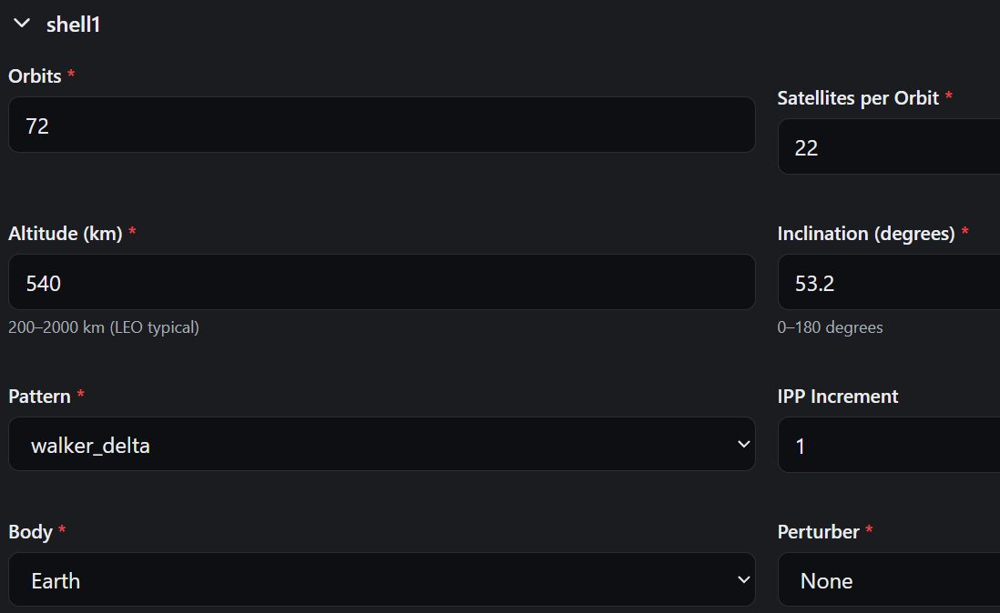
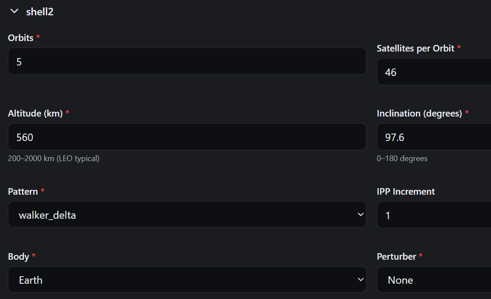

# SpaceNet Testbed: Local Development Setup

SpaceNet is a LEO satellite constellation simulation and emulation platform
developed at Virginia Tech by the Space Instrumentation and Systems Lab under the direction of Professor Samantha Kenyon. It simulates real-world and custom generated
satellite constellations, generates network topology and routing tables, and emulates network performance using Mininet.

## Table of contents

- [Prerequisites](#prerequisites)
- [First Time Step](#first-time-setup)
- [Access the App](#access-the-app)
- [Daily Usage](#daily-usage)
- [Rebuilding the App](#rebuilding-the-app)
- [Reset the App](#reset-the-app)
- [Running a simulation](#running-a-simulation)
    - [Current Simulation Limitations](#current-simulation-limitations)
- [Common Issues](#common-issues)
- [What each container does](#what-each-container-does)
- [Repository Structure](#repository-structure)
- [Tech Stack](#tech-stack)
- [License](#license)

## Prerequisites

- [Git](https://git-scm.com/install/) installed.
- [Docker Desktop](https://docs.docker.com/get-started/get-docker/) installed and running. On Windows, this requires WSL2 and a Linux distribution. To install WSL, open an administrator mode PowerShell or Command Prompt window and execute:
  ```powershell
  wsl --install
  ```
  This will activate WSL2 and install an Ubuntu distribution. For Linux or Mac, follow the instructions in the linked documentation.
- An SSH key added to your GitHub account and paired to your local machine (submodules clone over SSH) <!-- NOTE: Remove this when the public repo submodules are updated to HTTP -->
- 16GB RAM recommended (simulation is compute-heavy)

## First-Time Setup

Run the following commands in order:

1. Clone this repo
```bash
git clone https://github.com/VTSpaceNetLab/VTSpaceNetApp.git
cd VTSpaceNetApp
```

2. Initialize submodules (Phase 1 + Phase 2 simulation engines)
```bash
git submodule update --init --recursive
```

3. Creates your local environment files from the default templates. The root `.env` is required too hold the local database settings and the `spacenet-gui/.env` points to the backend API URL local to the system.

    bash (Linux, macOS, Git Bash, WSL):
    ```bash
    cp .env.example .env
    cp spacenet-gui/.env.example spacenet-gui/.env
    ```

    PowerShell (Windows):
    ```powershell
    Copy-Item .env.example .env
    Copy-Item spacenet-gui\.env.example spacenet-gui\.env
    ``` 

    > NOTE: Users are strongly advised to change the Postgres credentials in `.env` before moving to the next step. This credential would always be verified by SpaceNet processes whenever the app restarts further in the future. A system can only have one Postgres database volume and ONLY ACCESSIBLE to the set user credentials!

4. Build and start all the containers. (First-time build can take some time.)
```bash
docker compose up --build
```

## Access the App

Once running, open your browser:

| Service | URL |
|---|---|
| SpaceNet GUI | http://localhost:3000 |
| Backend API docs | http://localhost:5000/apidocs |

The app opens directly to the Experiments page - no login required.

## Daily Usage

```bash
# Start the stack
docker compose up

# Stop the stack (keeps all data)
docker compose down
```

### Rebuilding the App

To docker build your own version of app without erasing your experiment data: 
```bash
docker compose down
docker compose up --build
```

### Reset the App

To factory reset the app (deleting all external TLEs and ground station files) while making your past experiments inaccessible via App.
```bash
docker compose down -v
docker compose up --build
```
You can still locate your experiments in the project directory under `spacenet-backend/local_workspace/`

## Running a Simulation

1. Open http://localhost:3000
2. Click **New Experiment** and give it a name
3. Click **Create**
4. In the Experiment Configuration menu, enter desired parameters.
    - The default configuration (20 orbits, 15 satellites per orbit) is suitable for quick testing on a laptop.
5. Click **Run Simulation** → **Run Phase 1**
6. Monitor progress on the **Experiment Pipeline** or **Jobs** page
7. When Phase 1 completes, visualization output appears automatically.
8. After Phase 1 completes, click **Run Phase 2**.
9. View output either by downloading from the experiment pipeline page or navigating to the folder corresponding to your
experiment.

**Note:** Configurations with more satellites/orbits can take significantly longer and are CPU/memory-intensive - expect them to strain a laptop. Use the reduced configuration above for local testing.

### Current simulation limitations

- External TLEs can be imported to the app using the TLE page however it is expected to contain exactly the number fo satellites that are of interest for the experiment. This is a possible cause of `index out of range` errors if encountered.
- Current App version only supports multi-shell scenario for starting epoch at 27th Sept 2024 00:00:00 +-10 days, starlink operator and supporting only 2 shells (low incl and high incl Walker Delta). Please find the multi-shell specs below:


- Phase2 ping and iPerf results highly depend on the system's computing cores as well as the experiment setup. Therefore for a specific desired contellation spec if certain source-detination pair given `destination net unreachable` error, try using a different source-destination pair.

## Common Issues

**FATAL: password authentication failed for user "\${USER}"**
This error arises when the container is not authorized for the `${USER}` currently inside the `.env`. If you have not yet built any experiments for this user crediential, it is advised to [rebuild the app](#rebuilding-the-app). However if you have already built your experiments and your `.env` file has lost the original credentials then retrieve your original credentials from the history and [rebuild the app](#rebuilding-the-app).


**Port already in use:**
```bash
netstat -ano | findstr :3000
taskkill /PID 12345 /F
```

**Submodule errors (including "Permission denied (publickey)"):**
Make sure your SSH key is added to your GitHub account and you have access
to `VTSpaceNetPhase1` and `VTSpaceNetPhase2`, then:
```bash
git submodule update --init --recursive
```

**Docker Desktop not running:** Open Docker Desktop from your Start menu
and wait for it to fully start before running `docker compose` commands.

**Database errors:**

To inspect the database directly, open a `psql` shell in the database container:
```bash
docker exec -it spacenet-db psql -U spacenet_user -d spacenet_db
```

## What Each Container Does

| Container | Purpose |
|---|---|
| spacenet-gui | Next.js frontend (port 3000) |
| spacenet-backend | Flask REST API (port 5000) |
| spacenet-db | PostgreSQL database |
| spacenet-redis | Redis job queue broker |
| spacenet-worker | Runs simulation jobs (Phase 1 + 2) |
| spacenet-worker-plot | Runs visualization/GIF jobs |

## Repository Structure

```
VTSpaceNetApp/
├── docker-compose.yml                # All container definitions
├── .env.example                      # Template for .env (database credentials)
├── spacenet-gui/                     # Frontend (Next.js) - part of main repo
└── spacenet-backend/                 # Backend (Flask + workers)
    ├── dynamic-topology-generator/   # Submodule → VTSpaceNetPhase1 (orbit sim)
    └── constellation-simulator-main/ # Submodule → VTSpaceNetPhase2 (emulation)
```

## Tech Stack

- **Frontend:** Next.js 14, React 18, TypeScript, Tailwind CSS
- **Backend:** Flask (Python), PostgreSQL, Redis, RQ workers
- **Simulation:** Skyfield (SGP4), NetworkX (Floyd-Warshall)
- **Emulation:** Mininet v2.3.0

## License

This repository is licensed under the GNU General Public License v3.0 only
(GPL-3.0-only). See [LICENSE](LICENSE) for the full text.

---
Virginia Tech, Aerospace & Ocean Engineering | Dr. Samantha Parry Kenyon